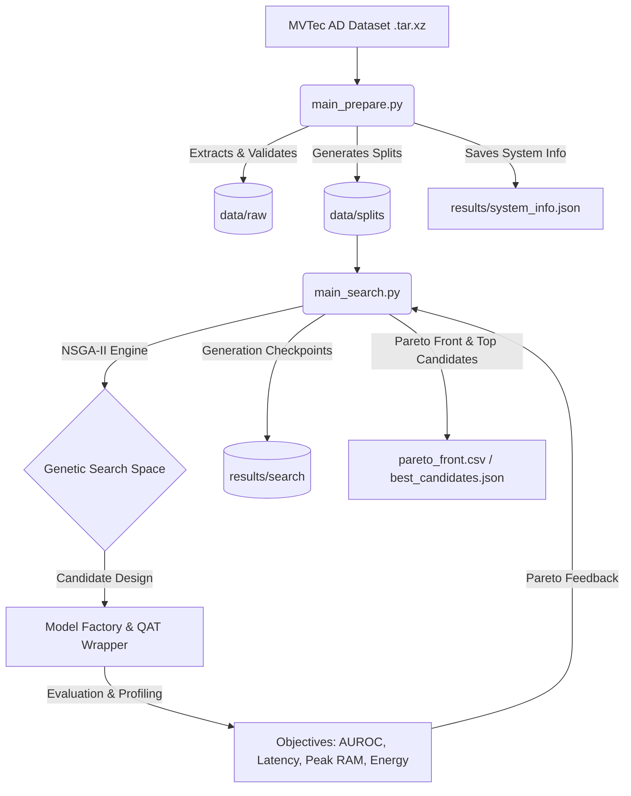

# MVTec AD Embedded NAS & Quantization-Aware Search Pipeline

[](https://www.python.org/)
[](https://pytorch.org/)
[](#)

This repository contains a professional research and engineering pipeline designed to search, optimize, and deploy Quantized Neural Networks (QNNs) for anomaly detection using the **MVTec AD** dataset. The primary goal of this pipeline is to find Pareto-optimal architectures that maximize anomaly detection accuracy while minimizing computational footprint, targeting resource-constrained embedded systems such as the **NVIDIA Jetson Nano** and **Jetson Orin Nano**.

---

## Table of Contents

- [Pipeline Overview](#pipeline-overview)
- [Core Optimization Objectives](#core-optimization-objectives)
- [System Architecture & Directory Layout](#system-architecture--directory-layout)
- [Hardware Workflows](#hardware-workflows)
- [Installation & Prerequisites](#installation--prerequisites)
- [Stage 1: Data Preparation (`main_prepare.py`)](#stage-1-data-preparation-main_preparepy)
- [Stage 2: Multi-Objective NSGA-II Search (`main_search.py`)](#stage-2-multi-objective-nsga-ii-search-main_searchpy)
- [Downstream Orchestration Scripts](#downstream-orchestration-scripts)
- [Watchdogs & Robustness Features](#watchdogs--robustness-features)
- [Troubleshooting](#troubleshooting)
- [Contributing](#contributing)
- [License](#license)

---

## Pipeline Overview

The project is structured as a two-stage core pipeline followed by retraining, reporting, and deployment scripts:



1. **Data Preparation (`main_prepare.py`)**: Automates dataset acquisition, checks structural integrity, splits data into stratified training, validation, and test datasets, and saves execution telemetry.
2. **Neural Architecture & Quantization Search (`main_search.py`)**: Conducts a multi-objective search using the **NSGA-II** algorithm to optimize both model topology and quantization parameters.

---

## Core Optimization Objectives

The search engine optimizes four conflicting objectives, all of which are minimized internally:

| Objective | Metric | Goal | Description |
| :--- | :--- | :--- | :--- |
| **$f_1$ (Accuracy)** | `-AUROC` | Maximize | Evaluates anomaly detection performance using the Area Under the ROC Curve. |
| **$f_2$ (Latency)** | `latency_ms` | Minimize | Average time (in milliseconds) taken for a single forward pass. |
| **$f_3$ (Memory)** | `peak_ram_mb` | Minimize | Peak RAM/VRAM consumption during inference. |
| **$f_4$ (Energy)** | `energy_mj` | Minimize | Energy consumption per inference (measured in milliJoules). |

Failed evaluations are penalized with pre-calibrated objective values (`[0.0, 9999.0, 65536.0, 9999.0]`) to ensure they are excluded from the Pareto front without inflating the hypervolume indicator.

---

## System Architecture & Directory Layout

The project follows a modular, object-oriented design structure:

```
├── config/                     # Configuration files (YAML format)
│   ├── deploy.yaml             # Deployment stage config
│   ├── report.yaml             # Analysis and reporting config
│   ├── retrain.yaml            # Fine-tuning / retraining config
│   ├── search.yaml             # NSGA-II search hyperparameters
│   └── tracking.yaml           # Experiment tracking setup
├── data/                       # Dataset directory (created during preparation)
│   ├── raw/                    # Extracted raw images from MVTec AD
│   ├── processed/              # Preprocessed image variants (optional)
│   └── splits/                 # Stratified Train/Val/Test CSV & JSON manifests
├── results/                    # Orchestrated output files
│   ├── dataset_summary.json    # Metadata and count statistics of prepared data
│   ├── system_info.json        # Snapshot of CPU/GPU/Jetson hardware specifications
│   └── search/                 # Logs, populations, and Pareto fronts from search
├── src/                        # Core codebase modules
│   ├── data/                   # Extraction, validation, and splitting logic
│   ├── deployment/             # Compilation and runtime deployment (TensorRT/ONNX)
│   ├── evaluation/             # Metrics, including AUROC computation
│   ├── models/                 # Neural Network model templates and factory
│   ├── nas/                    # Search space definition, genotype encoding, NSGA-II
│   ├── profiling/              # Latency, RAM, and Energy measurement instrumentation
│   ├── quantization/           # Quantization-Aware Training (QAT) wrappers
│   └── utils/                  # Random seeds setting and platform info utilities
├── main_prepare.py             # Data preparation orchestrator
├── main_search.py              # NSGA-II search orchestrator
├── main_deploy.py              # Deployment orchestrator
├── main_retrain.py             # Model retraining orchestrator
├── main_report.py              # Metric plotting and final report generator
├── main_tracking.py            # Active experiment tracking script
└── README.md                   # Project documentation
```

---

## Hardware Workflows

To achieve the best balance between speed and embedded realism, the project utilizes a split hardware workflow:

### 1. High-Performance Host PC (Exploration Phase)
- **Role**: Run the NSGA-II search loop (`main_search.py`) with a large population and multiple generations.
- **Hardware Requirement**: Desktop GPU (e.g., NVIDIA RTX series) to accelerate training and evaluation.
- **Energy Metering**: Uses PyNVML (`nvidia-ml-py`) to measure the graphics card's power draw.

### 2. Jetson Nano / Orin Nano Embedded Target (Deployment Phase)
- **Role**: Benchmark final candidate models under real-world embedded constraints and execute the deployment pipeline.
- **Hardware Requirement**: NVIDIA Jetson Nano or Orin Nano Developer Kit.
- **Energy Metering**: Queries `tegrastats` or internal power rails directly for accurate SoC power consumption.

---

## Installation & Prerequisites

### Prerequisites
- Python 3.8 or higher
- NVIDIA CUDA Toolkit (matching your GPU)
- JetPack SDK (if running on Jetson devices)

### Setup
1. **Clone the Repository**:
   ```bash
   git clone https://github.com/MichaelCifuentesMolano/Proyecto-MvTec-AD-Moveo.git
   cd Proyecto-MvTec-AD-Moveo
   ```

2. **Install Core Dependencies**:
   ```bash
   pip install torch torchvision numpy pyyaml
   ```

3. **Install Profiling Dependencies**:
   - **For PC Host (NVIDIA GPU)**:
     ```bash
     pip install nvidia-ml-py
     ```
   - **For Jetson Target**: No additional package is required (uses the built-in `tegrastats` tool).

---

## Stage 1: Data Preparation (`main_prepare.py`)

This script extracts and prepares the MVTec AD dataset. It generates deterministic, stratified train/validation/test splits.

### Expected Input
- A compressed MVTec AD archive (`mvtec_anomaly_detection.tar.xz`) at the project root directory.

### Basic Usage
```bash
python main_prepare.py --archive mvtec_anomaly_detection.tar.xz --val-ratio 0.15
```

### Key CLI Flags
* `--archive <path>`: Specify the location of the MVTec AD compressed archive.
* `--val-ratio <float>`: Proportion of train images reserved for validation (default: `0.15`).
* `--force`: Force extraction and overwrite existing split files.
* `--no-deterministic`: Disable deterministic CUDA algorithms.
* `--no-stratify`: Disable stratified splits based on defect types.
* `--quiet`: Reduce output logs to warnings only.

---

## Stage 2: Multi-Objective NSGA-II Search (`main_search.py`)

This script runs the NSGA-II search loop to discover optimized architectures. It requires that `main_prepare.py` has already been run.

### Basic Usage
```bash
python main_search.py --config config/search.yaml --category bottle --n-generations 30 --population-size 32
```

### Key CLI Flags
* `--config <path>`: Path to the search configuration YAML file (default: `config/search.yaml`).
* `--category <str>`: MVTec AD category to search for (e.g., `bottle`, `cable`, `transistor`).
* `--n-generations <int>`: Total number of evolutionary generations (default: `30`).
* `--population-size <int>`: Population size per generation (default: `32`).
* `--device <cpu|cuda>`: Hardware device to evaluate candidate models.
* `--resume-from <path>`: Path to a checkpoint (`.npz`, `.json`, or `.csv`) to resume the search.
* `--allow-noop-energy`: Tolelate a mock energy meter (e.g. if PyNVML is unavailable on a non-NVIDIA machine).
* `--keep-old`: Prevent cleanup of previous search results in the target directory.

### Output Files (Saved to `results/search/`)
* `evaluations.csv`: Raw data trace for every model evaluated during search.
* `history.csv`: Snapshot of all individuals sorted by generation.
* `pareto_front.csv`: The list of non-dominated optimal models discovered.
* `best_candidates.json`: The top $K$ models selected from the Pareto front.
* `latest_checkpoint.npz` / `latest_checkpoint.json`: Checkpoint files for resuming execution.

---

## Downstream Orchestration Scripts

While preparation and search are the core optimization blocks, the repository contains downstream entry-points:
* **`main_retrain.py`**: Fine-tunes selected architectures using extended training schedules and quantization settings.
* **`main_deploy.py`**: Compiles Pytorch models to ONNX and TensorRT runtimes on the Jetson platform.
* **`main_tracking.py`**: Monitors active resources and logs tracking statistics.
* **`main_report.py`**: Parses search logs to plot Pareto front charts and generate summaries.

---

## Watchdogs & Robustness Features

Embedded profiling is prone to run-time deviations. The pipeline integrates advanced protection features:

1. **Energy Backend Verification**: Prior to launching the search, the pipeline executes a Conv2d probe to ensure PyNVML or Tegrastats is responding. If the energy backend is dead, it fails early to prevent saving constant energy values.
2. **Pareto Degeneration Watchdog**: If the Pareto front grows to encompass $100\%$ of the population for 3 consecutive generations, the engine triggers an error, indicating that one of the objectives has lost its discriminative ability.
3. **Objective Variance Watchdog**: Monitors standard deviation of objectives on valid individuals. If $std < 10^{-9}$, it warns the operator of a frozen optimization objective.

---

## Troubleshooting

* **Energy Backend Fails to Initialize**:
  Ensure you are using an NVIDIA GPU and have installed `nvidia-ml-py`. On Jetson devices, ensure the user has execution permissions for `tegrastats`. If running on a CPU-only environment or VM without GPU profiling capability, run with the `--allow-noop-energy` flag.
* **OutOfMemory (OOM) Errors**:
  If a candidate architecture exceeds GPU memory, the evaluator handles the exception, logs the event, and applies the `penalty_objectives` to the individual, allowing the evolutionary search to continue uninterrupted.

---

## Contributing

1. Fork the repository.
2. Create your feature branch (`git checkout -b feature/AmazingFeature`).
3. Commit your changes (`git commit -m 'Add some AmazingFeature'`).
4. Push to the branch (`git push origin feature/AmazingFeature`).
5. Open a Pull Request.

---

## License

This project is licensed under the MIT License - see the LICENSE file for details.

---

## Uploading the Documentation

To upload this README file to your remote repository, execute the following commands in your shell:

```bash
git add README.md
git commit -m "docs: add professional README with NSGA-II search documentation"
git push origin main
```
